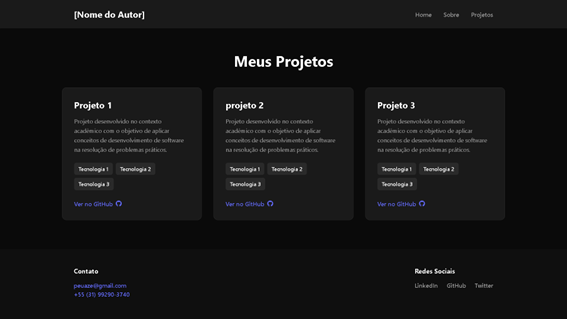

# 🏷️ Portfólio Profissional 

> Projeto acadêmico desenvolvido para a disciplina de **Laboratório de Desenvolvimento de Software**, com o objetivo de criar um portfólio web reutilizável.

---

## 🚧 Status do Projeto


---

## 📚 Índice
- [Wireframe](#-wireframe)
- [Protótipo](#-protótipo)
- [Sobre o Projeto](#sobre-o-projeto)
- [Funcionalidades](#-funcionalidades)
- [Autores](#-autores)
- [Tecnologias Utilizadas](#-tecnologias)
- [Estrutura do Projeto](#-estrutura-do-projeto)
- [Estrutura das Páginas](#-estrutura-das-páginas)
- [Como Executar](#-como-executar)


---

## 🔗 Wireframe

- 🎨 Figma: https://www.figma.com/design/FGR596awWqFuYUBk3jcczj/Portfolio

---

## 📷 Protótipo

- **Home:**  
  

- **Sobre:**  
  

- **Projetos:**  
  
  
---

## 📝 Sobre o Projeto

Portfólio web profissional desenvolvido como projeto acadêmico para a disciplina **Laboratório de Desenvolvimento de Software**.  
A aplicação apresenta uma estrutura moderna e reutilizável para exibição de informações profissionais, projetos e habilidades.  

**Principais características:**

- Suporte a múltiplos idiomas (Português e Inglês)  
- Geração de PDF com os dados do portfólio  
- Design moderno com backgrounds 3D interativos  
- Estrutura escalável e organizada para fácil manutenção e personalização  

---

## ✨ Funcionalidades

- 🏠 Página inicial com introdução do autor  
- 👤 Página **Sobre Mim** com descrição detalhada (PT/EN)  
- 💻 Exibição de habilidades  
- 📁 Projetos exibidos em formato de cards com descrição e tecnologias utilizadas
- 🔗 Links para repositórios  
- 📩 Área de contato (estrutura inicial)  
- 📄 Header e Footer padronizados  

---

## 👨‍💻 Autores

- Arthur Modesto Couto
- Bernardo Carvalho Denucci Mercado
- Mateus Azevedo Araújo
- Matheus Dias Mendes
  
---

## 🛠 Tecnologias

**Frontend:**

- React 19.2.0 – Biblioteca JavaScript para construção de interfaces  
- React Router DOM 7.13.1 – Gerenciamento de rotas e navegação entre páginas  
- React i18next 16.5.4 – Suporte a internacionalização (PT/EN)  
- Vite 7.3.1 – Ferramenta de build e servidor de desenvolvimento  

**Bibliotecas:**

- jsPDF 4.2.0 – Geração de documentos PDF do portfólio  
- @splinetool/react-spline 4.1.0 – Criação de backgrounds 3D interativos  

**Dev Tools:**

- ESLint 9.39.1 – Linter para padronização e qualidade de código  
- @vitejs/plugin-react 5.1.1 – Plugin React para integração com Vite  

---

## 📁 Estrutura do Projeto

```portfolio-app/
├── public/                    # Arquivos estáticos públicos
│   └── vite.svg              # Logo do Vite
├── src/                      # Código-fonte principal
│   ├── assets/               # Recursos estáticos
│   │   ├── css/             # Folhas de estilo
│   │   │   ├── App.css
│   │   │   ├── Home.css
│   │   │   ├── Sobre.css
│   │   │   ├── Projetos.css
│   │   │   ├── PDF.css
│   │   │   └── index.css
│   │   └── img/             # Imagens
│   │       ├── react.svg
│   │       └── user.png
│   ├── components/          # Componentes reutilizáveis
│   │   ├── Header.jsx       # Barra de navegação
│   │   ├── Header.css
│   │   ├── Footer.jsx       # Rodapé com contatos
│   │   ├── Footer.css
│   │   ├── Layout.jsx       # Layout principal
│   │   ├── Layout.css
│   │   ├── SplineBackground.jsx  # Fundo 3D interativo
│   │   └── SplineBackground.css
│   ├── pages/               # Páginas da aplicação
│   │   ├── Home.jsx         # Página inicial
│   │   ├── Home.css
│   │   ├── Sobre.jsx        # Página sobre (PT/EN)
│   │   ├── Sobre.css
│   │   ├── Projetos.jsx     # Listagem de projetos
│   │   ├── Projetos.css
│   │   ├── PDF.jsx          # Geração de PDF
│   │   ├── PDF.css
│   │   ├── Contato.jsx      # Formulário de contato
│   │   └── Contato.css
│   ├── data/                # Dados do portfólio
│   │   └── portfolioData.js # Informações centralizadas
│   ├── locales/             # Arquivos de tradução
│   │   ├── pt.json          # Traduções português
│   │   └── en.json          # Traduções inglês
│   ├── App.jsx              # Componente raiz
│   ├── App.css
│   ├── main.jsx             # Ponto de entrada
│   ├── index.css            # Estilos globais
│   └── i18n.js              # Configuração i18next
├── .env.example             # Exemplo de variáveis de ambiente
├── .gitignore               # Arquivos ignorados pelo Git
├── .hintrc                  # Configuração de hints
├── eslint.config.js         # Configuração ESLint
├── index.html               # HTML principal
├── package.json             # Dependências do projeto
├── package-lock.json        # Lock de dependências
├── README.md                # Documentação do projeto
└── vite.config.js           # Configuração Vite

```

## 📐 Estrutura das Páginas

- **Home:** Página inicial com apresentação e navegação  
- **Sobre mim:** Informações detalhadas e habilidades  
- **Projetos:** Listagem dos projetos desenvolvidos
- **PDF:** Geração do PDF com informações do portfólio
- **Header:** Navegação entre páginas  
- **Footer:** Contato e links adicionais  

---

## 🚀 Como Executar

```bash
npm install @splinetool/react-spline jspdf @emailjs/browser
npm run dev
```


